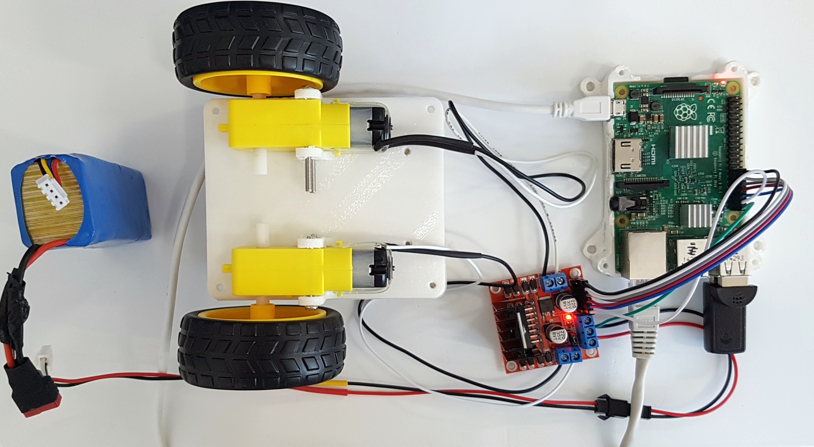
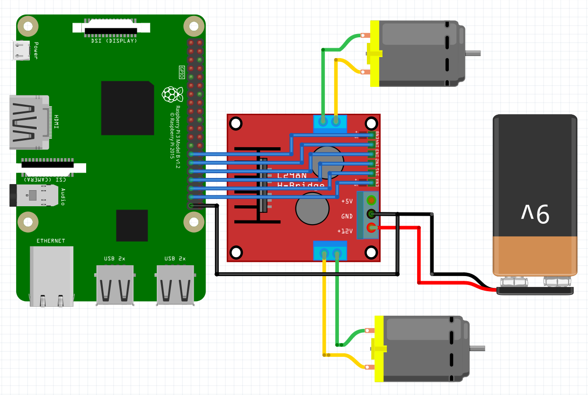
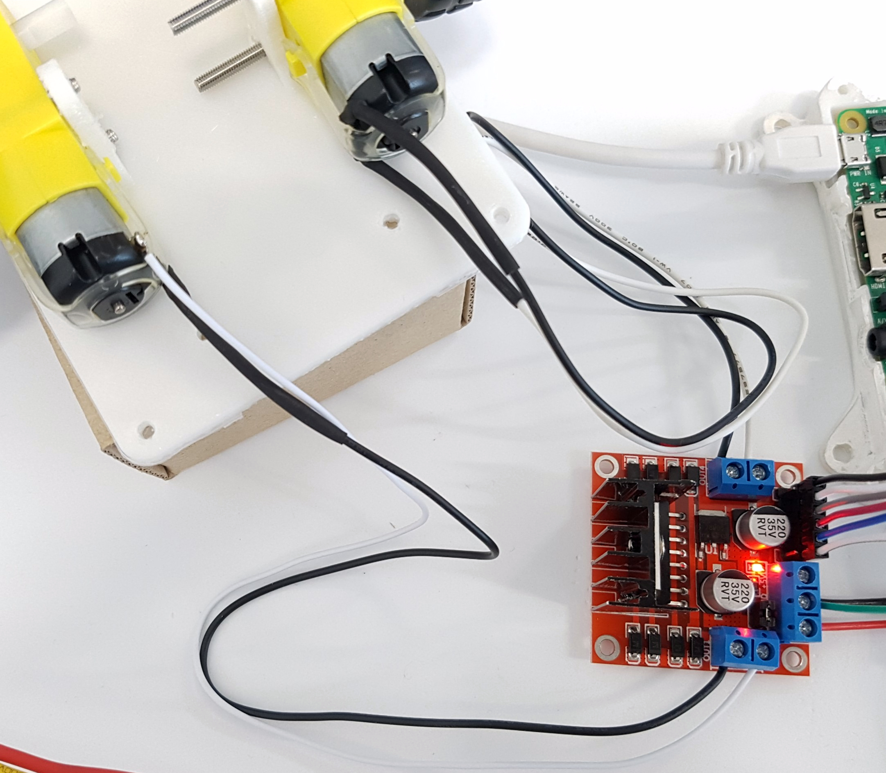
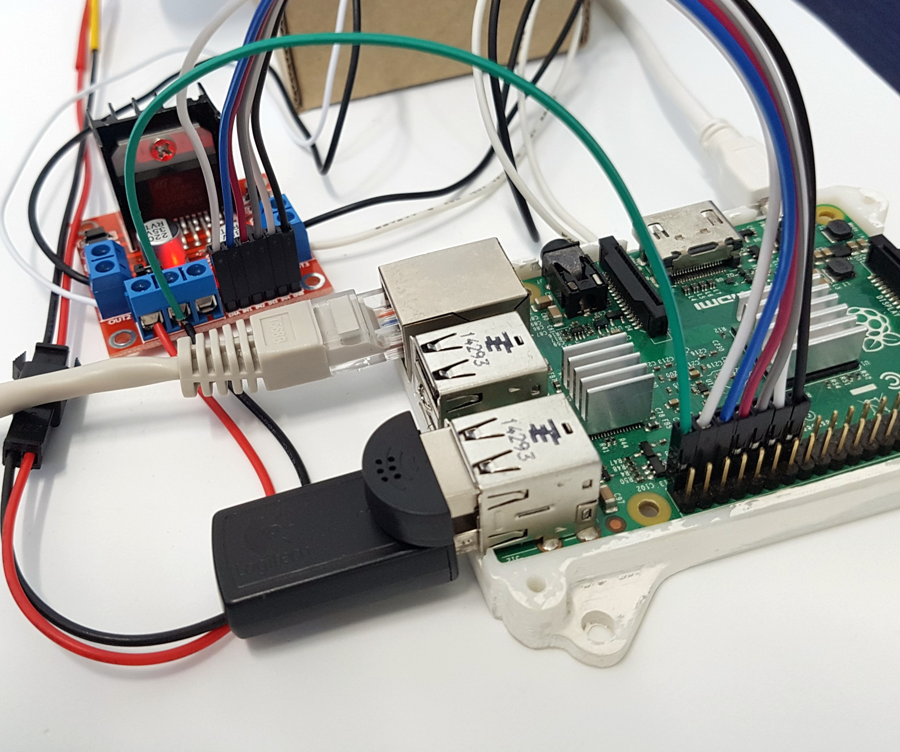

# 라즈베리파이 + l298 파이썬으로 제어하기

## 동작 영상

## WiringPi 패키지 설치
<pre>
<code>
$ sudo apt-get install python-dev
$ sudo pip install wiringpi
</code>        
</pre>

## 연결도
<pre>
라즈베리 파이              <>     L298n
#1, 27Pin BCM0          -       ENB
#2, 29Pin BCM5          -       IN4
#3, 31Pin BCM6          -       IN3
#4, 33Pin BCM13         -       IN2
#5, 35Pin BCM19         -       IN1
#6, 37Pin BCM26         -       ENA
#7, 39Pin GND           -       GND
</pre>

